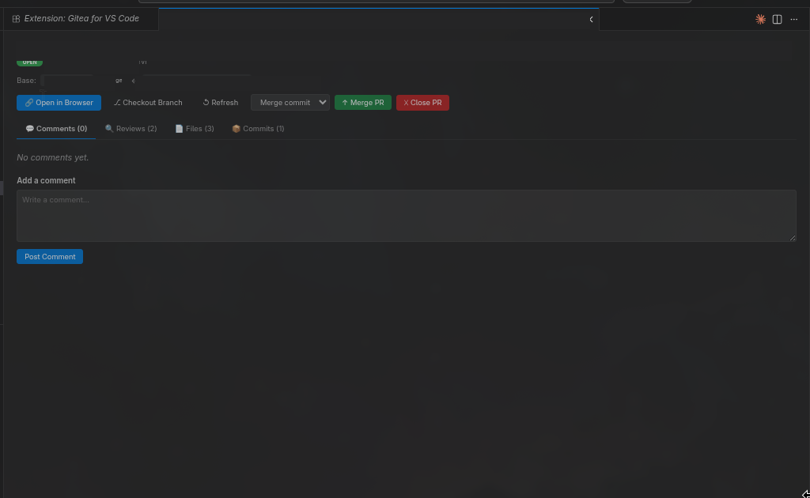
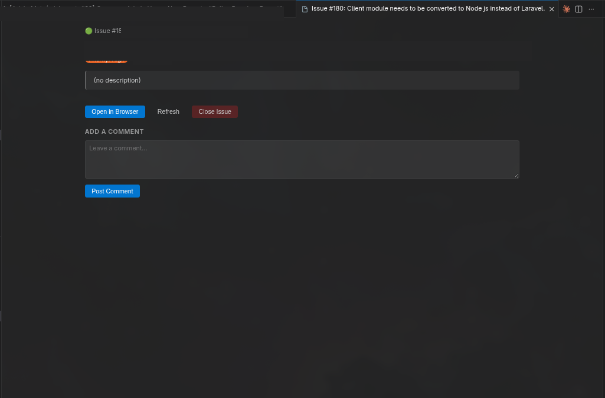
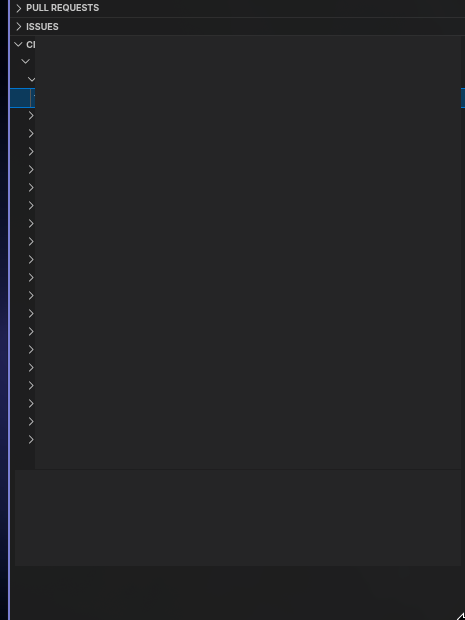

# Gitea for VS Code

A VS Code extension that brings your [Gitea](https://gitea.io) repositories directly into your editor — pull requests, issues, CI/Actions, inline code review, and more.

---

## Screenshots

**Pull Request detail — review, merge, close, change base:**



**Issue tracking — browse, create, comment, close:**



**CI / Actions — live run status and job logs:**



---

## Features

| Feature                | Description                                                                                                                |
| ---------------------- | -------------------------------------------------------------------------------------------------------------------------- |
| **Pull Requests**      | Browse, filter, merge, close, re-open PRs across all repos and submodules                                                  |
| **Inline Code Review** | GitHub-style diff viewer — click any line to comment, mark files as viewed, submit approve/request-changes/comment reviews |
| **Issues**             | Browse open/closed issues, create, close, re-open, add comments                                                            |
| **CI / Actions**       | See workflow runs and job statuses, re-run or cancel jobs, view logs                                                       |
| **Multi-repo**         | Automatically detects all git remotes and submodules in your VS Code workspace                                             |
| **Status Bar**         | Shows active repo + auth state at a glance                                                                                 |

---

## Requirements

- VS Code **1.85** or later
- A running **Gitea** instance (v1.17+ recommended for full Actions support)
- A Gitea **API token** with the correct permissions (see below)

---

## Installation

### From VSIX (manual)

1. Download the latest `.vsix` from the [Releases](../../releases) page.
2. In VS Code open the Command Palette (`Ctrl+Shift+P`) → **Extensions: Install from VSIX…**
3. Select the downloaded file.

### From source

```bash
git clone https://github.com/your-org/gitea-vscode-extension
cd gitea-vscode-extension
npm install
npm run compile
npx vsce package --no-dependencies
code --install-extension gitea-vscode-*.vsix
```

---

## Generating a Gitea API Token

1. Log in to your Gitea instance.
2. Go to **Settings → Applications → Access Tokens**.
3. Click **Generate Token**.
4. Give it a name (e.g. `vscode-extension`).

### Required Permissions

| Permission     | Level        | Reason                                         |
| -------------- | ------------ | ---------------------------------------------- |
| **Repository** | Read & Write | Browse PRs, issues, create comments, merge PRs |
| **Issue**      | Read & Write | Browse and manage issues                       |
| **Actions**    | Read         | View CI workflow runs and job logs             |

> `Write` on Repository is needed for merge, approve, close/re-open, and inline review actions. If you only want read-only access, set all to `Read`.

4. Copy the generated token — it is shown **only once**.

---

## Configuration

After installation, sign in via the Command Palette:

```
Gitea: Sign In
```

You will be prompted for:

- **Server URL** — e.g. `https://git.example.com` (no trailing slash)
- **API Token** — the token you generated above

The extension will automatically set `gitea.serverUrl` in your VS Code settings.

### Settings

| Setting           | Default | Description                                                                 |
| ----------------- | ------- | --------------------------------------------------------------------------- |
| `gitea.serverUrl` | `""`    | Override the Gitea server URL (useful when SSH hostname differs from HTTPS) |

**When do you need `gitea.serverUrl`?**
If your git remote uses SSH (`git@code-ssh.example.com`) but the API runs on a different hostname (`https://code.example.com`), set `gitea.serverUrl` to the HTTPS URL so the extension can match authentication correctly.

---

## Usage

### Pull Requests

Click the Gitea icon in the Activity Bar to open the sidebar. The **Pull Requests** panel shows all open PRs grouped by repository.

- **Expand a PR** to see branch info, labels, assignees, diff stats
- **View Details** opens the full PR panel with:
  - Description, stats, labels, milestone
  - Change base branch / edit title
  - Merge (merge commit / rebase / squash), close, re-open
  - Comments tab — add general PR comments
  - Reviews tab — see all submitted reviews
  - **Files tab** — full inline diff viewer (see below)
  - Commits tab

### Inline Code Review (Files tab)

The Files tab mirrors GitHub's PR review experience:

1. Each changed file starts **collapsed** — click the header to expand.
2. The diff loads **on demand** when you expand a file (no extra network calls until needed).
3. **Click any line** in the diff to open an inline comment form.
4. Type your comment and click **Add Review Comment** — it appears as a pending comment (orange, dashed border).
5. You can remove pending comments with ✕ before submitting.
6. Tick the **checkbox** on a file header to mark it as **Viewed** (the file collapses and dims).
7. When ready, fill in an optional overall comment and click **✅ Approve**, **⚠️ Request Changes**, or **💬 Comment Only**.
8. All pending inline comments are submitted in a single review.

### Issues

The **Issues** panel works similarly to PRs:

- Expand an issue to see labels, assignees, milestone, comment count
- **View Details** opens a webview with full body, existing comments, a comment form, and close/re-open buttons

### CI / Actions

The **CI / Actions** panel shows workflow runs per repository:

- Expand a run to see individual jobs
- Context menu → **Re-run Workflow** or **Cancel Run**
- Context menu → **View Job Logs** opens the log output in a webview

---

## Architecture

```
src/
├── api/
│   ├── giteaApiClient.ts   # All Gitea REST API calls
│   └── types.ts             # TypeScript interfaces
├── auth/
│   └── authManager.ts       # Token storage (VS Code SecretStorage)
├── commands/
│   ├── authCommands.ts      # Sign in / sign out
│   ├── prCommands.ts        # PR actions
│   ├── ciCommands.ts        # CI actions
│   └── issueCommands.ts     # Issue actions
├── context/
│   └── repoManager.ts       # Multi-repo / submodule detection via vscode.git API
├── ui/
│   └── statusBar.ts         # Status bar item
└── views/
    ├── pullRequestProvider.ts  # PR tree data provider
    ├── ciRunsProvider.ts       # CI tree data provider
    ├── issuesProvider.ts       # Issues tree data provider
    ├── prDetailPanel.ts        # PR webview panel (diff viewer)
    └── issueDetailPanel.ts     # Issue webview panel
```

---

## Contributing

See [CONTRIBUTING.md](CONTRIBUTING.md).

---

## License

[MIT](LICENSE)
